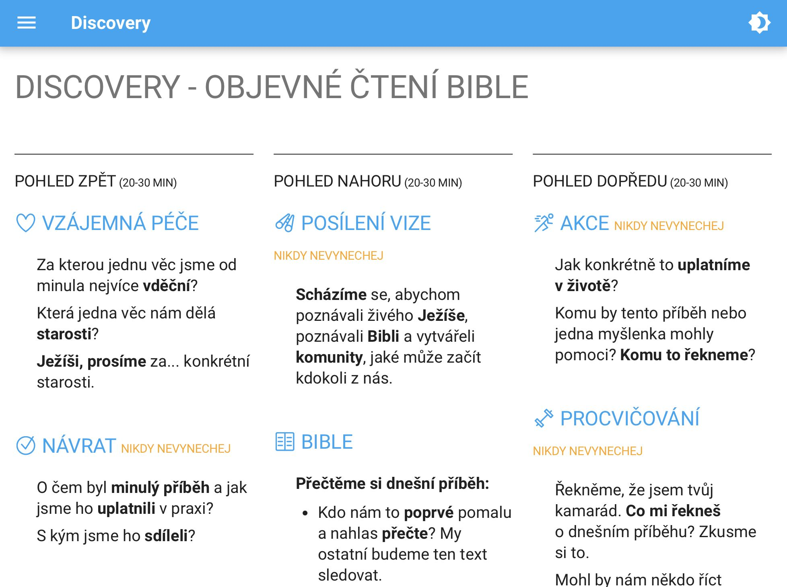
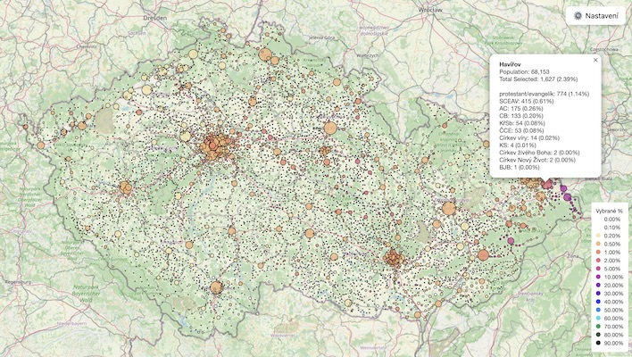
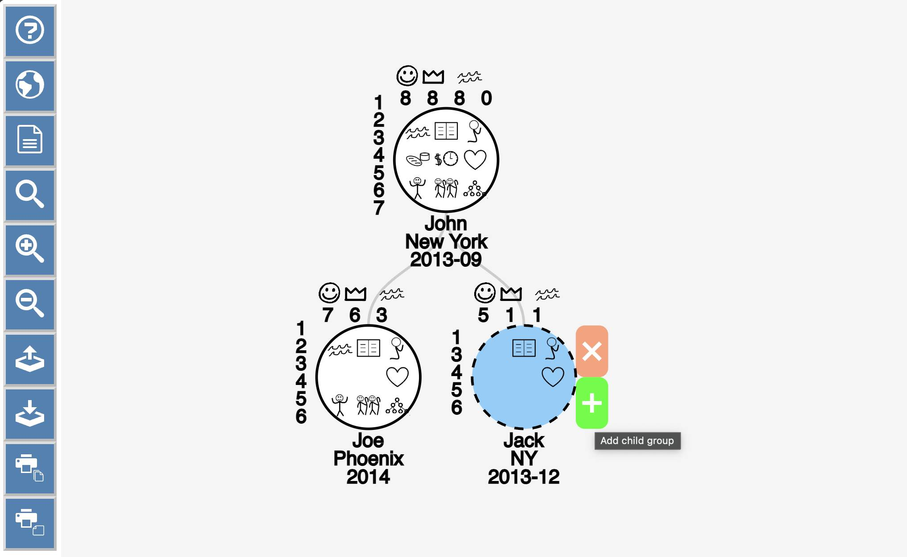

# Daniel Vopalecký
[LinkedIn](https://linkedin.com/in/danielvopalecky) | [Github](https://github.com/dvopalecky)

Senior Software Engineer | Education & AI Enthusiast

Full-stack software engineer with expertise in both frontend and backend development, specializing in building robust and user-friendly web applications. Experienced in JS/TS, Python, SQL, and modern web frameworks, with a growing focus on AI/LLM implementations.

## Skills
- Python: pandas, pydantic, pytest
- Javascript/Typescript: Svelte, bun, Node.js, Express
- SQL: MySQL, SQLite
- Git, CI/CD pipelines, Webpack, Rspack, Docker
- LLM API calls and prompt engineering
- Jest, Playwright, Cypress
- Data analysis & visualization
- Financial modeling & risk analysis

## Personal Projects

<table>
<tr>
<td width="50%">
  <h3><a href="https://vzdelavaciappky.cz">VzdelavaciAppky.cz</a></h3>
  
  
Curated directory of Czech educational apps for preschoolers from various developers.

</td>
<td width="50%">
  <h3><a href="https://discoverybible.cz">DiscoveryBible.cz</a></h3>
  
  
App used by tens of Discovery groups. Using MkDocs with customization and scripts to create nicely looking printable versions.

</td>
</tr>

<tr>
<td width="50%">
  <h3><a href="https://dvopalecky.github.io/nabozenstvi-v-cesku-mapa/obce.html">Religion in Czechia</a></h3>
  
  
Interactive visualization of religion by municipality or age.

</td>
<td width="50%">
  <h3><a href="https://dvopalecky.github.io/gen-mapper/">GenMapper</a></h3>
  
  
App for mapping generations of simple churches. Translated to 8 languages, used by leaders in church planting movements worldwide.

</td>
</tr>
</table>
